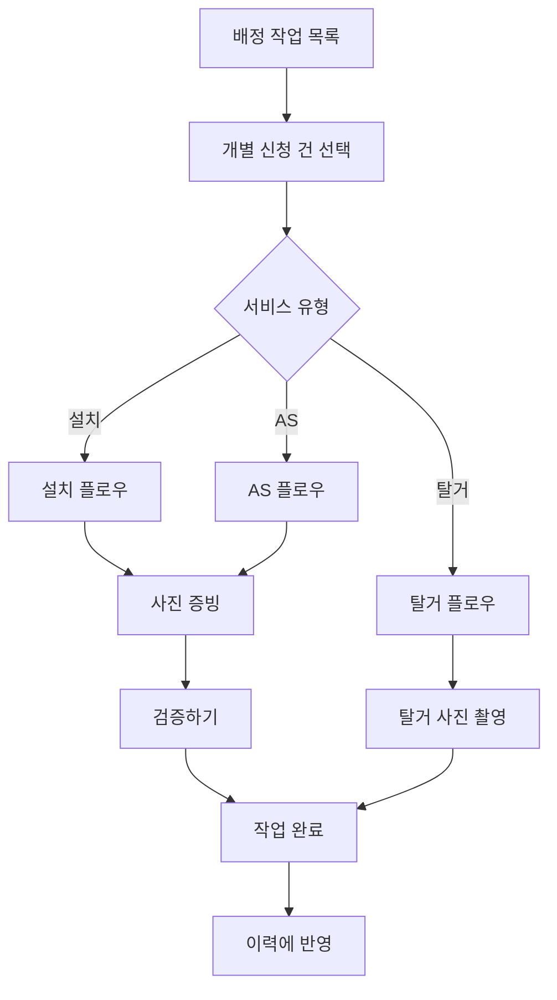
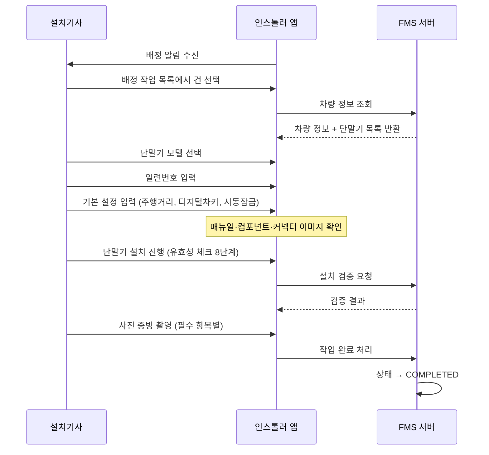

# [현장서비스 개선] PRD - 인스톨러 앱 (Installer App) v5.5

> **변경 이력**
> - v5.4 → v5.5 (2026-04-27): **검증 단계 실패 시 재시도 시나리오 전면 정의 (EX-14·EX-15 신규)**. OBD 검증 단계 중 기존에 정의되지 않았던 CarDB 설치 실패(EX-14)와 CarDB 결과 체크 실패(EX-15) 시나리오 추가. 두 케이스 모두 오류 팝업 + `[재시도]` + `[작업 불가]` 버튼 구성. **`[재시도]` 동작 정의 차별화**: EX-14는 step 1(CarDB 설치)부터 재진행, EX-15는 step 2(결과 체크)부터 재진행 — 이미 성공한 상위 단계를 재수행하지 않음. §5.1.6 OBD 오류 팝업 표 및 BR-24 갱신. HTML 프로토타입에 EX-14·EX-15 시나리오 버튼 + 팝업 + 단계별 재시작(`runValidation(startFrom)`) 구현. 어드민 측 변경 없음.
> - v5.3 → v5.4 (2026-04-27): **검증 단계 팝업 명세 정정 (OBD 모드 전체 8단계 보완)**. v5.3에서 OBD 모드 팝업이 시동 ON → 시동 OFF 순서로 잘못 정의되어 있었으며, 2~8번 팝업이 누락된 상태였음. 기존 PDF 플로우 재검토 결과: OBD 검증은 **시동 OFF부터 시작**(1/8)하여 시동 ON(4/8)으로 이어지는 순서가 올바름. **§5.1.6 OBD 모드 팝업 명세를 1/8~8/8 전체 8단계로 교체·정정**. (3/8·6/8 단계에 단말기 LED 점멸 이미지 포함 명시.) BR-24 OBD 모드 팝업 순서 설명 정정. 어드민 측 변경 없음.
> - v5.2 → v5.3 (2026-04-27): **검증 단계 팝업 명세 신설**. (1) **§4 예외처리 — EX-02·EX-03·EX-05 팝업 내용 상세화** (제목·본문·버튼 구성 명시). (2) **§4 EX-12·EX-13 신규 추가** — Non-OBD 시동 ON/OFF 타임아웃 오류 팝업. (3) **§5.1.6에 '검증 단계별 팝업 명세' 신규 서브섹션 추가** — OBD 모드(시동 ON/OFF 액션 안내 팝업·오류 팝업)·Non-OBD 모드(인라인 안내·오류 팝업)·시동잠금 테스트(인라인 배너·오류 팝업) 전체 정의. (4) **§6 BR-24 신규** — 검증 팝업 표시 의무 비즈니스 규칙. 어드민 측 연관 없음(검증 결과 기록·표시 정책은 어드민 PRD v9.1 §5.5.5에서 불변).
> - v5.1 → v5.2 (2026-04-15): **이미지 정책 어드민 연동 명세 보완**. (1) **§5.3 작업 불가 처리 — 어드민 상세 팝업 증빙 사진 표시 정책 명확화** (작업 결과 섹션에 사유 + 증빙 사진 썸네일 노출). (2) **§5.3에 운영 완료 처리와의 관계 정리 추가** (작업 불가 증빙 사진은 인스톨러 앱 측에서만 첨부 가능하며, 어드민 운영 완료 증빙 사진과 별도 섹션으로 구분 관리됨). 어드민 측 정책은 `Admin/02_Draft/PRD_어드민.md` v9.1 §5.5.6 참조.
> - v5.0 → v5.1 (2026-04-15): **설치 안내 이미지 출처 정책 전면 재정의**. (1) 설치 매뉴얼 / 컴포넌트 / 커넥터 이미지 출처를 "타 DB(CarDB)"에서 **어드민 설치 매뉴얼 관리 메뉴 등록 이미지**로 변경. (2) OBD 설치형태 차량에도 상시전원 인가 이미지가 존재할 수 있음을 명시 (이미지 유무는 설치형태가 아닌 어드민 등록 여부로 결정). (3) 이미지 미연동 시 표시 정책 — 4종 공통 fallback UI 형태 정의 (상시전원 인가 미연동 화면 형태 기준). (4) 설치 매뉴얼·컴포넌트 fallback 메시지 신규 추가 (기존에는 이미지 미연동 fallback 없음). (5) 외부 시스템 의존성에서 CarDB 이미지 연동 항목 제거.
> - v4.3 → v5.0 (2026-04-14): **운영팀 요청(2026-04-13) 반영**. (1) **§5.1.2/5.1.3 배정 작업 목록·작업 상세 — 차종(차량모델) 표시 추가**. (2) **§5.1.4 설치 플로우 — Non-OBD 차량에서 `[Non-OBD 호출]` 미완료 시 다음 단계 진행 차단 (버튼 비활성화)**. (3) **§5.3 작업 불가 처리 — 사유 선택 + 증빙 사진 1장 이상 필수 첨부**. (4) **§5.1.6 검증 결과 페이지 — 차량번호 헤더 표시 + `[재검증]` 버튼 신설** (패킷 검증 실패 시 재작업 전에 검증만 재시도). (5) **§5.1.4 펌웨어 기록 3종 세분화** — CarDB / OBD / APP 버전을 설치·AS 완료 시 서버에 기록. (6) **§4 EX-10 운영 완료 건 처리** — 어드민에서 운영팀이 완료 처리한 건은 앱 목록에서 자동 제거 + 이력에 `완료 (운영)` 표기. BR-20~BR-23 추가. 충돌 분석: `01_Resources/260413 미팅/260413_충돌사항_정리.md`.
> - v4.2 → v4.3 (2026-04-10): **증빙사진 페이지 전면 재설계** + **검증 진행 Non-OBD 모드 간소화**.
>   - **증빙사진 항목 재정의**: 필수 6장(차량 번호판 / 차대번호 / 메인배선 연결 / 단말기 고정 / GPS 고정 / 시동차단 연결) + 선택 2장(연료배선 연결 / 상시전원 연결). **차량 설치형태가 `Non-OBD`인 경우 상시전원 연결 사진이 필수**로 전환.
>   - **사진 촬영 모드 전환 방식 변경**: v4.1의 기사 직접 토글 버튼 폐기 → **시스템 자동 판단**으로 회귀. 판단 기준은 "검증 실패 후 `[재작업]` 버튼을 통해 재진입했는지" 여부. BR-02 보강.
>   - **최초 촬영 UX**: 각 항목은 `[촬영하기]` 버튼만 노출. 촬영 후 썸네일 프리뷰 + `[재촬영]` 버튼으로 전환.
>   - **재작업 UX**: 검증 실패 후 `[재작업]` 버튼 클릭 → 설치 프로세스 재진행 → 증빙사진 페이지 재진입 시 각 항목에 `[촬영하기]` + `[첨부하기]`(갤러리 선택) 버튼이 함께 노출됨.
>   - **검증 진행 Non-OBD 간소화**: Non-OBD 모드에서는 OBD 초기화·CarDB·운행 패킷 유효성 8단계를 **검증 리스트에 표시하지 않음**(기존에는 "Non-OBD 패스" 라벨로 나열). 곧바로 시동 ON/OFF 테스트로 진입.
>   - **시동 ON/OFF 테스트 → 시동잠금 테스트 순서 명시**: Non-OBD 시 시동 ON(activation) → 시동 OFF(trip) → (시동잠금 설치 건) 시동잠금 테스트 → 검증 결과의 순서로 진행.
> - v4.1 → v4.2 (2026-04-10): `[Non-OBD 호출]` 버튼 노출 조건 명시 — **차량 데이터의 설치형태가 `Non-OBD`인 경우에만 노출**한다. OBD 차량에서는 버튼을 렌더링하지 않으며 표준 OBD 검증 플로우를 따른다. §5.1.4 설정 페이지 / §5.1.6 검증 단계 보강.
> - v4.0 → v4.1 (2026-04-10): v4.0 미결 사항 클리어 반영. (a) **재작업 모드는 시스템 자동 판단 X** — 기사가 증빙사진 촬영 화면 상단의 `[재작업]` 토글 버튼으로 직접 전환 (BR-02 보강). (b) Non-OBD 호출 결과 차량 데이터 동기화 논의는 본 단계 보류 명시. (c) 임시 등록 → 정상 차량 교체 시 BR-01 중복 검출 UX는 어드민 측 정책서 §5에 명시. 그 외 미결 사항(취소 사유 카테고리화 / 업체 담당자 연락처 마이그레이션)은 v4.0 결정 그대로 유지.
> - v3.5 → v4.0 (2026-04-10): 운영팀 합동 회의(2026-04-10) 결정사항 반영. (1) 작업 목록·작업 상세 화면에 **업체 담당자 연락처 + 작업 주소** 표시 추가. (2) **임시 등록 차량(차량번호 `00000000`) 처리** — 작업 시작 시 안내 팝업 + 진행 차단. (3) **재작업 시 카메라+앨범 사진 선택 허용** (BR-02 분기 규칙). (4) **차대번호 사진 첨부** 신규 필수 항목. (5) **단말기 일련번호 입력 인풋 옆 `[Non-OBD 호출]` 버튼 신설** — 현장에서 단말기 OBD 모드를 Non-OBD로 변경 가능. (6) **Non-OBD 검증 단계 변경** — 운행 패킷 유효성 8단계 패스 + 시동 ON/OFF 테스트(activation/trip 패킷) 추가. (7) **작업불가 처리는 인스톨러 앱 전용**으로 어드민 권한 폐지 반영. (8) "작업 희망일" → "작업 요청일" 워딩 변경. 충돌 사항 4건은 `01_Resources/260410 미팅/260410_충돌사항_정리.md` 참조.
> - v3.4 → v3.5 (2026-04-02): 검증 결과 항목 정리 — "시동제어 테스트 결과"가 "시동감지 결과"와 중복으로 확인되어 삭제. 검증 결과 12개 → 11개로 변경. 완료 조건에서도 시동제어 테스트 제거.
> - v3.3 → v3.4 (2026-03-31): 2차 크로스체크 반영 — (1) 시각적 로직 Mermaid 다이어그램에 검증 단계 추가(누락 보완). (2) AS 플로우에 "AS 사유는 앱에 표시하지 않음(어드민 운영팀 전용)" 명시. (3) AS 직접입력 요청사항의 앱 내 표시 방식 명시(직접입력 텍스트가 항목명으로 표시). (4) 작업불가 사유 입력을 자유 텍스트에서 선택형(차량 부재/차량 키 부재/통신 불가 지역/기타)으로 변경하여 어드민과 통일.
> - v3.2 → v3.3 (2026-03-31): 크로스체크 잔여 이슈 반영 — (1) EX-06 용어 명확화("STAFF 이력"→"STAFF(어드민)에 UNABLE 상태로 기록"). (2) 배정 작업 목록에 설치형태(OBD/Non-OBD) 표시 추가. (3) 취소 알림 수신 시 앱 처리 정의(알림 표시+목록 자동 제거). (4) 검증 결과에 시동잠금 제어 검증 결과 추가 및 GPS 음영지역 체크 장치 추가. (5) 이력 상세 검증 결과 전체 항목(12개) 표시로 확대. (6) 설치형태 변경 시 작업 초기화 안내 기능 추가. (7) 취소 건 이력 미표시로 변경.
> - v3.1 → v3.2 (2026-03-27): 7차 논의 반영 — 설치형태(OBD/Non-OBD)는 차량 데이터 귀속으로 현장서비스에서 변경 불가(검증 시 차량 설치형태 체크: OBD→CarDB 검증, Non-OBD→CarDB 패스). 참조 이미지 순서 변경(상시전원→매뉴얼→컴포넌트→커넥터) 및 모든 이미지 항상 표시(조건부 표시 제거). 이미지 미연동 시 안내 메시지 추가. 검증 단계에 시동잠금 제어 검증 별도 버튼 추가(운행 패킷 유효성 체크 8단계 후 진행).
> - v3.0 → v3.1 (2026-03-25): 5차 논의 반영 — 설치/교체 시 설정 페이지에서 디지털차키·시동잠금 설치 여부를 읽기 전용으로 변경(기사 수정 불가, 운영팀이 어드민에서 수정).
> - v2.0 → v3.0 (2026-03-24): 4차 논의 반영 — 작업 프로세스 전면 변경. 설치/AS 모두 "작업 목록 → 개별 작업 → 증빙사진 → 검증하기" 통합 프로세스 적용. 검증 단계를 작업 끝으로 분리·공통화(OBD 설정 초기화~운행패킷 유효성 체크). 검증 결과 12항목 표시. GPS 음영지역 체크 장치 추가. 검증 후 완료 조건(시동제어/전원연결/시동감지 비정상 시 완료 불가, GPS 감도는 음영지역 체크로 예외). 운영팀 메모 작업 상세 화면 표시.
> - v1.0 → v2.0 (2026-03-23): 운영팀 2차 회의 반영 — 하단 탭 2개로 정리(배정 작업 목록/이력), 배정 작업 목록 화면 신규 설계, 설치 플로우에 매뉴얼/컴포넌트/커넥터/상시전원 이미지 화면 추가, 증빙사진 항목 변경(필수 3장), AS 플로우·탈거 플로우 어드민 연동, 이력 화면 재설계.
> - v1.0 (2026-03-20): 초안 작성. 기존 인스톨러앱 플로우 PDF 및 2026-03-20 현장서비스 미팅 내용 기반.

---

## 1. 개요 (Overview)
- **목적**: 설치기사가 현장에서 단말기 설치·탈거·AS 작업을 수행하고, 작업 결과(사진·SN·검증)를 체계적으로 기록하여 완료 처리하는 모바일 앱.
- **접근 대상**: **설치기사** (설치관리자는 인스톨러 앱 사용 불가, 어드민만 사용).
- **동작 환경**: 온라인 전용 (Always Online). 오프라인 모드 미지원.

---

## 2. 네비게이션 구조 (Navigation Architecture)

### 2.1 하단 탭 바 (Bottom Tab Bar)
- *(v2.0) 탭을 **2개**로 정리:*
  - `배정 작업 목록` — 배정된 현장서비스 신청 건 목록 및 작업 진행
  - `이력` — 완료된 작업 이력 조회
- 활성 탭: 파란색 아이콘 + 텍스트 하이라이트.

### 2.2 로그인 화면
- IMS.connect INSTALLER 전용 앱.
- 아이디 / 비밀번호 입력 → 인스톨러 로그인.
- 로그인 시 설치기사 계정 정보 로드 (이름, 소속업체, 담당구역).

---

## 3. 시각적 로직 (Visual Logic)

### 3.1 작업 유형별 플로우 개요

*(v3.4) 검증 단계를 다이어그램에 추가. 탈거는 검증 없이 사진 촬영 후 완료.*

### 3.2 설치 작업 시퀀스

---

## 4. 에지 케이스 및 예외 처리 (Edge Cases & Exception Handling)

| ID    | 예외 상황 | 대응 방안 |
| :---- | :-------- | :-------- |
| EX-01 | 단말기 모델 잘못 선택 | 일련번호 매칭 실패 시 "해당 모델에 등록된 단말기가 없습니다" 안내 |
| EX-02 | OBD 설정 초기화 실패 | **오류 팝업 표시** *(v5.3 상세화)*: 제목 "단말기 초기화 실패" / 본문 "단말기가 OBD 포트에 올바르게 연결되어 있는지 확인해 주세요. 재시도하시겠습니까?" / 버튼 `[재시도]` `[작업 불가]`. `[재시도]` 선택 시 해당 단계부터 재진행. `[작업 불가]` 선택 시 §5.3 작업불가 처리 시트로 이동. |
| EX-03 | 운행 패킷 유효성 체크 중 시동 미감지 *(v5.4 정정: 6/8 단계에서 기사가 [아니오] 선택 시 = LED 2회 점멸 미확인, Activation 패킷 미수신 타임아웃)* | **오류 팝업 표시** *(v5.3 상세화)*: 제목 "시동이 감지되지 않습니다" / 본문 "단말기가 차량 시동을 감지하지 못했습니다. 아래 사항을 확인해 주세요:\n① 단말기 LED가 빨간 동그라미로 2번씩 깜빡이는지 확인\n② OBD 포트 연결 상태 재확인\n③ 차량 시동이 켜진 상태인지 확인" / 버튼 `[재시도]` `[작업 불가]`. |
| EX-04 | Non-OBD 차량 CarDB 미설치 | CarDB 오류 무시 가능 (Non-OBD는 CarDB 불필요). *(v4.0)* 현장에서 단말기를 Non-OBD로 전환해야 하는 경우, 설정 페이지의 `[Non-OBD 호출]` 버튼으로 즉시 변환 가능. |
| EX-05 | 시동잠금 테스트 실패 | **오류 팝업 표시** *(v5.3 상세화)*: 제목 "시동잠금 테스트 실패" / 본문 "시동잠금 제어에 실패했습니다. 아래 사항을 확인하고 재시도해 주세요:\n① 차량 시동이 완전히 꺼진 상태인지 확인\n② ACC 모드(반시동)가 아닌지 확인\n③ 시동 OFF 후 최소 5초가 경과했는지 확인" / 버튼 `[재시도]`. |
| EX-06 | 설치 불가 (현장 사유) | 설치 불가 상태 처리 + 사유 입력 → STAFF(어드민)에 '작업불가(UNABLE)' 상태로 기록. *(v4.0)* **작업불가 처리는 본 인스톨러 앱 전용**이며, 어드민 측 작업불가 처리 권한은 폐지됨. |
| EX-07 | GPS 음영 지역 (안테나 교체 AS) | GPS 감도 빨간불 시 "음영 지역" 체크 후 완료 가능 |
| EX-08 | 디지털 차키 실패 | "[IMS] 로 등록된 디바이스가 아닙니다" 안내 → 확인 후 진행 |
| EX-09 | 임시 등록 차량 (차량번호 `00000000`) | *(v4.0 신규)* 작업 상세 화면 진입은 가능하나 `[작업 시작]` 클릭 시 안내 팝업 출력 후 진행 차단: "해당 차량은 카코드 확인이 필요합니다. 운영팀에 차대번호 전달 및 문의 부탁 드립니다." 운영팀이 차대번호를 받아 정상 차량으로 교체하면, 기사는 작업 목록을 새로고침하여 정상 진행 가능. |
| EX-10 | 운영 완료 처리된 건 | *(v5.0 신규)* 어드민에서 운영팀이 `[운영 완료 처리]` 버튼으로 완료 처리한 건은 앱의 배정 작업 목록에서 **자동 제거**되며, 이력 탭에는 `완료 (운영)` 보조 배지로 표기된다. 기사가 해당 건의 작업 상세 화면에 진입해 있던 경우 푸시 알림으로 "운영팀이 본 건을 완료 처리하였습니다" 안내 후 목록 복귀. |
| EX-11 | Non-OBD 차량 `[Non-OBD 호출]` 미완료 | *(v5.0 신규)* 차량 설치형태가 `Non-OBD`인 경우 `[Non-OBD 호출]` 버튼을 통해 단말기 Non-OBD 모드 변환이 선행되어야 한다. 호출이 수행되지 않은 상태에서는 설정 페이지의 `[다음]` 버튼이 비활성화되며, hover/tap 시 "Non-OBD 호출을 먼저 진행해 주세요." 안내 토스트 표시. |
| EX-12 | Non-OBD 시동 ON 테스트 타임아웃 (activation 패킷 미수신) | *(v5.3 신규)* 기사가 `[시작]` 버튼을 눌렀으나 일정 시간 내 Activation 패킷이 수신되지 않을 경우 **오류 팝업 표시**: 제목 "시동이 감지되지 않습니다" / 본문 "Activation 패킷이 수신되지 않았습니다. 차량 시동이 켜진 상태인지 확인하고 재시도해 주세요." / 버튼 `[재시도]` `[작업 불가]`. |
| EX-13 | Non-OBD 시동 OFF 테스트 타임아웃 (trip 패킷 미수신) | *(v5.3 신규)* 기사가 `[시작]` 버튼을 눌렀으나 일정 시간 내 Trip 패킷이 수신되지 않을 경우 **오류 팝업 표시**: 제목 "시동 OFF가 감지되지 않습니다" / 본문 "Trip 패킷이 수신되지 않았습니다. 차량 시동이 완전히 꺼진 상태인지 확인하고 재시도해 주세요." / 버튼 `[재시도]` `[작업 불가]`. |
| EX-14 | OBD 모드 — CarDB 설치 실패 | *(v5.5 신규)* 차량 DB(CarDB) 설치 단계(step 1)에서 서버 응답 실패 시 **오류 팝업 표시**: 제목 "차량 DB 설치 실패" / 본문 "차량 DB(CarDB) 설치에 실패했습니다. OBD 포트 연결 상태를 확인해 주세요." / 버튼 `[재시도]` `[작업 불가]`. `[재시도]` 선택 시 **step 1(CarDB 설치)부터 재진행** — step 0(OBD 설정 초기화)은 이미 완료되어 재수행하지 않음. `[작업 불가]` 선택 시 §5.3 작업불가 처리 시트로 이동. |
| EX-15 | OBD 모드 — CarDB 결과 체크 실패 | *(v5.5 신규)* 차량 DB 설치 결과 체크 단계(step 2)에서 검증 실패 시 **오류 팝업 표시**: 제목 "차량 DB 검증 실패" / 본문 "차량 DB 설치 결과가 정상이 아닙니다. 단말기 연결 상태를 재확인해 주세요." / 버튼 `[재시도]` `[작업 불가]`. `[재시도]` 선택 시 **step 2(CarDB 결과 체크)부터 재진행** — step 0~1은 이미 완료 상태를 유지. `[작업 불가]` 선택 시 §5.3으로 이동. |

---

## 5. 화면 및 UI 구조 (UI/Layout Architecture)

### 5.1 배정 작업 목록 탭

#### 5.1.1 검색 기능
- 상단 검색바: **차량번호 또는 업체명 또는 지점명**으로 검색.
- 검색 결과: 검색어를 포함하는 결과 표시.

#### 5.1.2 현장서비스 신청 목록
- 현장서비스 신청 건 중 **로그인한 설치기사에게 배정된 목록**을 **작업 요청일 순서** *(v4.0 워딩 변경)* 로 표시.
- **개별 목록 내 표시 사항**: 차량번호 / **차종(차량모델)** *(v5.0 신규)* / 업체명 / 지점명 / 서비스 유형 / **설치형태(OBD/Non-OBD)** *(v3.3 추가)* / **작업 주소** *(v4.0 신규)* / **업체 담당자 연락처** *(v4.0 신규)*.
- *(v5.0)* **차종 표시**: 차량 데이터의 차량모델(예: `기아 레이`, `현대 포터2`, `벤츠 E-Class`)을 차량번호 아래 줄에 부제 형태로 표시. 기사가 현장 도착 시 어느 차량인지 식별하는 보조 수단.
- *(v4.0)* **임시 등록 차량 표시**: 차량번호가 `00000000`인 임시 등록 건은 차량번호 옆에 `임시` 배지를 표시하여 기사가 한눈에 식별 가능.
- *(v4.0)* **업체 담당자 연락처**: 어드민 신청 시 입력된 업체 담당자 연락처. 탭하면 전화 다이얼러 자동 실행 (`tel:` 링크).
- 클릭 시 **개별 신청 건 상세 화면**으로 이동.

#### 5.1.3 개별 신청 건 상세 화면

**공통 구조 — 작업 상세 화면**:
- 차량 정보 (차량번호, **차종(차량모델)** *(v5.0 신규)*, 업체명, 지점명, 서비스유형, **설치형태(OBD/Non-OBD)**) 표시.
- **서비스 정보**: **작업 요청일** *(v4.0 워딩 변경)* / **작업 주소** *(v4.0 신규 노출)* / **업체 담당자 연락처** *(v4.0 신규 노출)*.
- *(v3.0)* **운영팀 메모 표시**: 어드민에서 입력한 메모 내용을 작업 상세 화면에 표시하여 기사가 현장에서 확인 가능.
- `[작업 시작]` 버튼 + `[작업 불가]` 버튼.
- *(v4.0)* **임시 등록 차량 진입 처리**: 차량번호가 `00000000`인 임시 등록 건의 경우, 작업 상세 화면 진입 자체는 허용하나 `[작업 시작]` 버튼 클릭 시 다음 안내 팝업이 표시되며 다음 단계 진행이 차단된다 — **"해당 차량은 카코드 확인이 필요합니다. 운영팀에 차대번호 전달 및 문의 부탁 드립니다."** 팝업의 `[확인]` 클릭 시 작업 상세 화면 유지(목록 복귀 X). 운영팀이 차대번호를 받아 어드민 수정 팝업에서 정상 차량으로 교체하면, 작업 목록을 새로고침하여 정상 차량 정보가 반영된 상태로 작업 진행 가능.

#### 5.1.4 작업 프로세스 — 설치 플로우

*(v3.0) AS와 동일하게 작업 목록 기반 프로세스로 변경.*

1. **작업 시작** → 작업 목록 화면 진입
2. **작업 목록 화면**: 설치 작업 항목을 목록으로 표시. 작업 항목 클릭 시 해당 작업 진행.
3. **개별 작업 진행** (검증 이전까지의 단계):
   - 단말기 모델 선택 (CAMD1000, CAMD2000, CAMD2500, CAMD2500K, CAMD2500LD, CAMD2500KD, CAMD3000BK, CAMD3000BL, CAMD3000BKC)
   - 설정 페이지:
     - **일련번호 입력 (필수)** — 텍스트 입력 인풋.
       - *(v4.0)* **인풋 우측 `[Non-OBD 호출]` 버튼** — *(v4.2 노출 조건 명시)* **차량 데이터의 설치형태가 `Non-OBD`인 경우에만 버튼을 렌더링**한다. OBD 차량에서는 버튼 자체를 표시하지 않으며 표준 OBD 검증 플로우(CarDB + 운행 패킷 유효성 8단계)를 따른다.
       - 본 버튼 클릭 시 해당 단말기의 OBD 모드를 Non-OBD로 즉시 변환(어드민 GNB의 `Non OBD 설정` 기능과 동일 동작). 호출 결과는 버튼 하단에 표시(성공/실패 + 변환된 모드 표기). 변환 성공 시 검증 단계가 Non-OBD 분기(시동 ON/OFF 테스트 모드, §5.1.6 참조)로 자동 전환됨.
       - *(v5.0)* **Non-OBD 차량 `[다음]` 버튼 제어**: 차량 설치형태가 `Non-OBD`인 경우, 설정 페이지의 `[다음]` 버튼은 **`[Non-OBD 호출]`이 성공적으로 완료될 때까지 비활성화** 상태를 유지한다. 기사가 비활성화된 `[다음]` 버튼을 tap 하거나 hover 하면 "Non-OBD 호출을 먼저 진행해 주세요." 안내 토스트가 표시된다. OBD 차량에서는 본 제약이 적용되지 않는다(Non-OBD 호출 버튼 자체가 렌더링되지 않음).
     - 총 주행거리 입력 (필수)
     - 디지털 차키 설정 / 시동잠금 설정 (어드민 신청값 자동 표시, **읽기 전용** — *(v3.1) 설치기사가 변경 불가. 수정이 필요한 경우 운영팀을 통해 어드민에서 해당 건을 수정해야 함.*)
   - *(v3.2) 참조 이미지는 누락 없이 항상 표시되며, 순서가 변경됨:*
     - **상시전원 인가 차량 이미지**: **어드민 설치 매뉴얼 관리 메뉴에 등록된 이미지**를 표시. *(v5.1 예외)* OBD 설치형태 차량이라도 어드민에 상시전원 인가 이미지가 등록되어 있으면 표시됨. 이미지 유무는 설치형태가 아닌 어드민 등록 여부로 결정. *연동 이미지가 없는 경우: 공통 fallback UI 표시 — "해당 차량에 대한 상시전원 인가 안내 이미지가 등록되지 않았습니다. 운영팀에 문의해 주세요."*
     - **설치 매뉴얼 이미지**: **어드민 설치 매뉴얼 관리 메뉴에 등록된 이미지**를 표시. *(v5.1)* *연동 이미지가 없는 경우: 공통 fallback UI 표시 — "해당 차량에 대한 설치 매뉴얼 이미지가 등록되지 않았습니다. 운영팀에 문의해 주세요."*
     - **컴포넌트 이미지**: **어드민 설치 매뉴얼 관리 메뉴에 등록된 이미지**를 표시. *(v5.1)* *연동 이미지가 없는 경우: 공통 fallback UI 표시 — "해당 차량에 대한 컴포넌트 이미지가 등록되지 않았습니다. 운영팀에 문의해 주세요."*
     - **커넥터 이미지**: **어드민 설치 매뉴얼 관리 메뉴에 등록된 이미지**를 표시. *(v5.1)* *연동 이미지가 없는 경우: 공통 fallback UI 표시 — "해당 차량의 시동잠금 관련 설치 안내 이미지가 등록되지 않았습니다. 운영팀에 문의해 주세요."*
     - *(v5.1) 공통 fallback UI 형태*: 각 이미지 화면의 이미지 표시 영역을 노란색 안내 박스(경고 아이콘 + "연동 이미지 없음" 헤딩 + 이미지별 안내 메시지)로 대체. 화면 진행(이전/다음 버튼)은 이미지 연동 여부와 무관하게 항상 활성화.
4. **증빙사진 첨부** *(v4.3 전면 재설계)*:
   - **필수 6장 (공통)**: 차량 번호판 / 차대번호 / 메인배선 연결 / 단말기 고정 / GPS 고정 / 시동차단 연결
   - **선택 2장**: 연료배선 연결 / 상시전원 연결
   - **Non-OBD 설치형태 시**: 상시전원 연결 사진이 **필수**로 전환(→ 필수 7장)
   - **차대번호 사진 목적** *(v4.0)*: 카코드 매칭 정확도 검증 + 추후 차대번호 → 카코드 자동 매핑 AI 학습 자료 확보.
   - **촬영 모드 — 시스템 자동 판단** *(v4.3 변경)*:
     - **최초 촬영 모드**: 작업 목록에서 처음 들어온 경우. 각 항목 카드에 `[촬영하기]` 버튼만 노출. 촬영 완료 시 썸네일 프리뷰 + `[재촬영]` 버튼으로 자동 전환.
     - **재작업 모드**: 검증 실패 후 `[재작업]` 버튼을 눌러 설치 프로세스를 재진행한 경우. 각 항목 카드에 `[촬영하기]` + `[첨부하기]`(갤러리 선택) 두 버튼이 함께 노출. 이미 촬영된 항목은 `[재촬영]` + `[첨부하기]`.
     - 모드 전환은 기사가 직접 하지 않으며 시스템이 재작업 플래그(`photoMode`)를 자동 설정한다.
   - 상단 안내 배너로 현재 모드를 명확히 표시 (최초 촬영 — 파랑 / 재작업 — 주황).
5. **작업 완료** → 작업 목록으로 복귀
6. **검증하기**: 작업 목록의 모든 작업이 완료되면 `[검증하기]` 버튼 활성화
7. **검증 진행** → 검증 결과 표시 → 재작업 또는 작업 완료 처리

#### 5.1.5 작업 프로세스 — AS 플로우

- *(v3.4)* **AS 사유는 앱에 표시하지 않음**. AS 사유는 어드민 운영팀 전용 정보이며, 인스톨러 앱에서는 AS 요청사항만 표시됨.

1. **작업 시작** → 작업 목록 화면 진입
2. **작업 목록 화면**: 어드민에서 지정한 AS 요청사항을 목록으로 표시. 각 항목 클릭 시 해당 작업 진행. *(v3.4)* `직접입력` 요청사항의 경우 어드민에서 입력한 텍스트가 항목명으로 그대로 표시됨.
3. **요청사항별 개별 작업 진행**:
   - **단말기 단순 교체 / 단말기 모델 교체**: **설치 작업과 완전히 동일한 프로세스**를 진행.
   - **그 외** (메인케이블/안테나/릴레이/배선/설치형태/디지털차키 탈거/직접입력): 증빙사진 첨부 후 완료
4. **작업 완료** → 작업 목록으로 복귀. 해당 항목 완료 표시.
5. **검증하기**: **요청사항 목록이 모두 완료되면** `[검증하기]` 버튼 활성화
6. **검증 진행** → 검증 결과 표시 → 재작업 또는 작업 완료 처리

#### 5.1.6 검증 단계 (설치/AS 공통) *(v4.0 Non-OBD 분기 추가)*

*(v3.0) 기존 유효성 체크 8단계를 작업 끝의 "검증" 단계로 분리·공통화.*

**검증 진행 — OBD 모드**:
- OBD 설정 초기화 → CarDB 설치 → CarDB 결과 체크 → 운행 패킷 유효성 체크 (시동 ON/OFF 감지) — 기존 8단계와 동일한 절차를 검증 단계로 통합.
- *(v3.2)* **설치형태별 CarDB 처리**: 검증 시 차량 데이터의 설치형태를 체크하여, OBD인 경우 CarDB 정상 여부를 검증하고, Non-OBD인 경우 CarDB 정상 여부를 패스함.
- *(v3.2)* **시동잠금 제어 검증**: 운행 패킷 유효성 체크 8단계 완료 후, **시동잠금 제어 검증을 별도 버튼**(`[시동잠금 테스트]`)을 통해 진행. 시동잠금 설치 건에 대해 시동 잠금/해제 테스트를 수행.

**검증 진행 — Non-OBD 모드** *(v4.0 신규, v4.2 노출 조건, v4.3 UI 간소화)*:
- 진입 조건: **차량 데이터의 설치형태가 `Non-OBD`** 인 경우. (차량 설치형태가 OBD이면 본 분기로 진입할 수 없으며, `[Non-OBD 호출]` 버튼도 설정 페이지에 렌더링되지 않는다.)
- Non-OBD 차량에서 기사가 설정 페이지의 `[Non-OBD 호출]` 버튼으로 단말기 OBD 모드를 Non-OBD로 변환하면, 호출 성공 시 본 검증 분기가 활성화된다.
- *(v4.3)* **패스되는 단계(OBD 설정 초기화 / CarDB 설치 / CarDB 결과 체크 / 운행 패킷 유효성 체크 8단계)는 검증 리스트에 표시하지 않는다.** 대신 "Non-OBD 모드 검증 — CarDB 및 운행 패킷 유효성 체크는 패스됩니다. 아래의 시동 ON/OFF 테스트를 진행해 주세요." 안내 카드만 노출한다.
- *(v4.3)* **진행 순서**: 시동 ON 테스트(activation 패킷 수신) → 시동 OFF 테스트(trip 패킷 수신) → (시동잠금 설치 건인 경우) 시동잠금 제어 검증 → 검증 결과 화면. 시동 OFF 완료 시점에 시동잠금 섹션이 자동 노출되며 섹션으로 부드럽게 스크롤된다.
- **운행 패킷 유효성 체크 8단계는 패스**하고, 대신 다음 시동 ON/OFF 테스트만 수행한다:
  - **시동 ON 테스트**: 차량 시동을 켠 후 단말기로부터 `activation 패킷`이 수신되면 패스.
  - **시동 OFF 테스트**: 차량 시동을 끈 후 단말기로부터 `trip 패킷`이 수신되면 패스.
- 두 테스트 모두 패스 시 운행 패킷 유효성 검증을 정상으로 간주.
- 시동잠금 제어 검증은 OBD 모드와 동일하게 별도 버튼으로 수행 (시동잠금 설치 건 한정).

**Non-OBD 호출 정책**:
- *(v4.2 노출 조건)* **본 버튼은 차량 데이터의 설치형태가 `Non-OBD`인 경우에만 설정 페이지에 렌더링**된다. OBD 차량에서는 버튼이 표시되지 않으며, 표준 OBD 검증 플로우가 강제 적용된다.
- 본 호출은 **단말기 단위** OBD 모드 변환이며, **차량 데이터의 설치형태와는 분리**된다. 차량 데이터의 설치형태는 여전히 차량 관리 메뉴(어드민)에서만 변경 가능.
- 호출 결과(성공/실패)는 설정 페이지의 `[Non-OBD 호출]` 버튼 하단에 즉시 표시되며, 검증 단계 분기에 즉시 반영된다.

**검증 결과 표시 항목** (11개) *(v3.5 변경: 시동제어 테스트 결과 삭제 — 시동감지 결과와 중복)*:
1. 단말기 기종
2. 단말기 SN
3. 디지털차키 설치 여부
4. 시동잠금 설치 여부
5. GPS 좌표
6. 총 주행거리
7. 연료잔량
8. 단말기 전원연결 결과 (정상/비정상)
9. 시동감지 결과 (정상/비정상)
10. **시동잠금 제어 검증 결과 (정상/비정상)** *(v3.3 추가)*
11. GPS 감도 확인 결과 — 정상: `정상` / 비정상+음영지역 체크: `비정상 (음영지역)` *(v3.3 변경)*

**GPS 음영지역 처리**:
- GPS 감도 확인 결과가 비정상인 경우, "음영지역이라 GPS 감도 확인이 불가능합니다" 체크박스 표시.
- 기사가 음영지역 체크 시 해당 건을 완료할 수 있음.
- 어드민에서 음영지역으로 인한 GPS 감도 확인 불가 건임을 확인하고 sorting할 수 있어야 함.

**검증 후 완료 조건**:
- **단말기 전원연결 결과, 시동감지 결과** 중 하나라도 비정상인 경우 → **작업 완료 불가** (재작업 필요). *(v3.5 변경)*
- GPS 감도 확인 결과를 제외한 모든 검증 결과가 정상인 경우 → **완료 처리 가능**.
- 재작업 선택 시 작업 목록으로 복귀하여 해당 항목 재진행.

**검증 결과 페이지 UI** *(v5.0 신규)*:
- **차량번호 헤더**: 검증 결과 페이지 최상단에 현재 작업 중인 **차량번호와 차종(차량모델)** 을 크게 표시. 예: `08허1234 / 현대 포터2`.
- **`[재검증]` 버튼** *(v5.0 신규)*: 검증 결과 화면 하단에 `[재검증]` / `[재작업]` / `[작업 완료]` 3개 버튼 배치.
  - **`[재검증]`**: **패킷 검증 실패 시** 재작업 프로세스를 거치지 않고 **검증 단계만 다시 실행**. 클릭 시 §5.1.6 검증 단계별 팝업 명세에 따라 팝업이 다시 표시되며 검증 프로세스가 처음부터 재진행됨. 증빙사진·설정 입력값은 유지된다.
  - **`[재작업]`**: 실제 재시공이 필요한 경우 설치 프로세스 전체를 재진행. BR-02 재작업 모드 진입 → 증빙사진 갤러리 첨부 허용.
  - **`[작업 완료]`**: 모든 검증 항목이 정상(GPS 제외)일 때만 활성화.
- **`[재검증]` 노출 조건**: 검증 결과 11항목 중 **단말기 전원연결 / 시동감지 / 시동잠금 제어 검증** 중 하나 이상이 비정상일 때만 `[재검증]` 버튼을 활성화한다. 모두 정상이면 `[작업 완료]`만 활성화.

---

**검증 단계별 팝업 명세** *(v5.3 신규, v5.4 정정)*

검증 진행 중 각 단계에서 기사에게 표시되는 팝업 및 인라인 안내를 아래와 같이 정의한다.

> **[v5.4 정정]** OBD 모드 팝업 순서: v5.3에서 "1/8 직전 시동 ON → Activation 후 시동 OFF" 순서로 잘못 기술됨. **올바른 순서는 시동 OFF 먼저(1/8), 이후 시동 ON(4/8)** 이다. 아래 8단계 명세가 확정 내용.

**[OBD 모드 팝업 — 운행 패킷 유효성 체크 1/8 ~ 8/8]**

| 단계 | 발생 시점 | 유형 | 제목 | 본문 | 버튼 |
| :---: | :--- | :--- | :--- | :--- | :--- |
| 1/8 | 운행 패킷 유효성 체크 1단계 직전 | 액션 안내 팝업 (차단형) | "차량 시동을 꺼주세요." | "단말기 Trip 패킷 수신을 확인하기 위해 차량 시동을 꺼주세요." | `[진행]` |
| 2/8 | 1/8 완료 후 | 확인 팝업 | "차량 시동이 꺼졌나요?" | "차량 시동이 꺼진 것을 확인해 주세요. 아직 꺼지지 않았다면 [아니오]를 눌러 대기 후 재확인해 주세요." | `[아니오]` `[네]` |
| 3/8 | 2/8 완료 후 | 확인 팝업 (단말기 이미지 포함) | "단말기 LED를 확인해 주세요." | "단말기 바코드 아래 빨간 동그라미 안 'O'부분이 1번씩 깜박거리나요? 아니라면 최장 1분 대기해주세요. (단말기가 차량의 시동을 인식중입니다.)" | `[아니오]` `[네]` |
| 4/8 | 3/8 완료 후 | 액션 안내 팝업 (차단형) | "차량 시동을 켜주세요." | "단말기 Activation 패킷 수신을 위해 차량 시동을 켜주세요." | `[진행]` |
| 5/8 | 4/8 완료 후 | 확인 팝업 | "차량 시동이 켜졌나요?" | "차량 시동이 켜진 것을 확인해 주세요. 아직 켜지지 않았다면 [아니오]를 눌러 대기 후 재확인해 주세요." | `[아니오]` `[네]` |
| 6/8 | 5/8 완료 후 | 확인 팝업 (단말기 이미지 포함) | "단말기 LED를 확인해 주세요." | "단말기 바코드 아래 빨간 동그라미 안 'O'부분이 2번씩 깜박거리나요? 아니라면 최장 1분 대기해주세요. (단말기가 차량의 시동을 인식중입니다.)" | `[아니오]` `[네]` |
| 7/8 | 6/8 완료 후 | 액션 안내 팝업 | "다음 단계로 진행합니다." | "패킷 수신 확인이 완료되었습니다. 다음 단계로 이동합니다." | `[진행]` |
| 8/8 | 7/8 완료 후 | 완료 팝업 (펌웨어 버전 표시) | "설치가 정상적으로 완료되었습니다." | "패킷 유효성 체크가 모두 완료되었습니다. (CarDB 버전 / OBD 버전 / APP 버전 표시)" | `[완료]` |

> **팝업 동작 규칙**:
> - 액션 안내 팝업 (`[진행]` 단일 버튼): 기사가 `[진행]`을 누르기 전까지 다음 단계 진행 차단.
> - 확인 팝업 (`[아니오]` / `[네]`): `[아니오]` 선택 시 "단말기 확인중..." 대기 상태 표시 후 자동 재확인 유도. `[네]` 선택 시 다음 단계로 즉시 진행.
> - 3/8 및 6/8 단말기 이미지: 개발팀이 단말기 LED 점멸 상태를 시각적으로 보여주는 이미지를 제공하여 팝업 내에 표시한다.
> - EX-03 트리거: **6/8 확인 팝업에서 기사가 `[아니오]` 를 선택**하고 자동 재확인 후에도 LED 2회 점멸이 확인되지 않을 경우 → EX-03 오류 팝업 표시.

**[OBD 모드 오류 팝업]**

| 발생 시점 | 유형 | 제목 | 본문 | 버튼 |
| :--- | :--- | :--- | :--- | :--- |
| OBD 설정 초기화 실패 시 | 오류 팝업 (EX-02) | "단말기 초기화 실패" | "단말기가 OBD 포트에 올바르게 연결되어 있는지 확인해 주세요. 재시도하시겠습니까?" | `[재시도]` `[작업 불가]` |
| CarDB 설치 실패 시 *(v5.5 신규)* | 오류 팝업 (EX-14) | "차량 DB 설치 실패" | "차량 DB(CarDB) 설치에 실패했습니다. OBD 포트 연결 상태를 확인해 주세요." | `[재시도]` `[작업 불가]` |
| CarDB 결과 체크 실패 시 *(v5.5 신규)* | 오류 팝업 (EX-15) | "차량 DB 검증 실패" | "차량 DB 설치 결과가 정상이 아닙니다. 단말기 연결 상태를 재확인해 주세요." | `[재시도]` `[작업 불가]` |
| 6/8 단계에서 Activation 패킷 미수신 타임아웃 | 오류 팝업 (EX-03) | "시동이 감지되지 않습니다" | "단말기가 차량 시동을 감지하지 못했습니다.\n아래 사항을 확인해 주세요:\n① 단말기 LED가 빨간 동그라미로 2번씩 깜빡이는지 확인\n② OBD 포트 연결 상태 재확인\n③ 차량 시동이 켜진 상태인지 확인" | `[재시도]` `[작업 불가]` |
| 시동잠금 테스트 버튼 상단 (항상 노출) | 인라인 안내 배너 | — | "차량 시동이 완전히 꺼진 상태에서 버튼을 눌러 주세요. 잠금 → 해제 순서로 테스트가 자동 진행됩니다." | — |
| 시동잠금 테스트 실패 시 | 오류 팝업 (EX-05) | "시동잠금 테스트 실패" | "시동잠금 제어에 실패했습니다.\n아래 사항을 확인하고 재시도해 주세요:\n① 차량 시동이 완전히 꺼진 상태인지 확인\n② ACC 모드(반시동)가 아닌지 확인\n③ 시동 OFF 후 최소 5초가 경과했는지 확인" | `[재시도]` |

**[Non-OBD 모드 팝업 및 인라인 안내]**

| 발생 시점 | 유형 | 내용 |
| :--- | :--- | :--- |
| 검증 화면 진입 시 | 인라인 안내 배너 (상단 고정) | "Non-OBD 모드 검증 — OBD 초기화·차량 DB·운행 패킷 유효성 체크 8단계는 자동 패스됩니다. 아래의 시동 ON/OFF 테스트를 진행해 주세요." |
| 시동 ON 테스트 `[시작]` 버튼 상단 | 인라인 안내 텍스트 | "차량 시동을 켜주세요. `[시작]` 버튼을 누르면 Activation 패킷 수신 대기를 시작합니다." |
| 시동 ON 대기 중 (`[시작]` 클릭 후) | 인라인 스피너 + 텍스트 | "Activation 패킷 수신 대기 중... 차량 시동 ON 상태를 유지해 주세요." |
| 시동 ON 테스트 타임아웃 | 오류 팝업 (EX-12) | 제목: "시동이 감지되지 않습니다" / 본문: "Activation 패킷이 수신되지 않았습니다.\n차량 시동이 켜진 상태인지 확인하고 재시도해 주세요." / 버튼: `[재시도]` `[작업 불가]` |
| 시동 OFF 테스트 진입 시 (시동 ON 완료 후) | 인라인 안내 텍스트 | "차량 시동을 꺼주세요. `[시작]` 버튼을 누르면 Trip 패킷 수신 대기를 시작합니다." |
| 시동 OFF 대기 중 (`[시작]` 클릭 후) | 인라인 스피너 + 텍스트 | "Trip 패킷 수신 대기 중... 차량 시동이 완전히 꺼진 상태인지 확인해 주세요." |
| 시동 OFF 테스트 타임아웃 | 오류 팝업 (EX-13) | 제목: "시동 OFF가 감지되지 않습니다" / 본문: "Trip 패킷이 수신되지 않았습니다.\n차량 시동이 완전히 꺼진 상태인지 확인하고 재시도해 주세요." / 버튼: `[재시도]` `[작업 불가]` |
| 시동잠금 테스트 (Non-OBD, 시동잠금 설치 건) | OBD 모드와 동일한 인라인 배너 + 오류 팝업 적용 | OBD 모드 팝업 명세와 동일 |

> **TBD** — 타임아웃 기준 시간(초): 시동 ON/OFF 패킷 수신 대기 타임아웃 임계값은 개발팀이 단말기 스펙 기준으로 별도 확정 필요. 확정 전까지 구현 시 30초를 기본값으로 사용.

---

#### 5.1.7 설치형태 변경 시 작업 초기화 *(v3.3 추가)*
- 작업 진행 중 특정 차량의 설치형태가 운영팀에 의해 변경된 경우, 인스톨러 앱에서 해당 작업을 **초기화**하고 설치기사가 재진행할 수 있도록 안내한다.
- 안내 메시지 표시 후 작업 목록으로 복귀하여 변경된 설치형태 기준으로 재작업 진행.

#### 5.1.8 개별 신청 건 상세 화면 — 탈거 플로우
- 현장서비스 어드민 내 개선 사항 연동.
- 탈거 확인 팝업 → 단말기 탈거 사진 촬영 (필수).
- 디지털차키가 설치되어 있는 차량의 경우:
  - 작업 완료 이미지 필수.
  - 디지털차키 원복 동영상 필수 (기사가 원복 작업 완료 선택 시).
- 탈거 완료 처리.

---

### 5.2 이력 탭

#### 5.2.1 검색 기능
- **차량번호 또는 업체명 또는 지점명**으로 검색.

#### 5.2.2 연월별 작업 건 정렬 (Sorting)
- 상단 정렬 컨트롤: `yyyy년` / `mm월` 선택.
- 기본값: `전체` (모든 기간 표시).

#### 5.2.3 작업 결과 목록
- **작업 완료일 순서**로 표시.
- **개별 목록 내 표시 사항**: 차량번호 / 업체명 / 지점명 / 서비스 유형 / 작업 완료일시 / **작업완료 여부** (`완료` / `작업불가`).
- **본인 작업 건만 표시** (다른 기사 작업 건 미노출).
- *(v3.3)* **취소 건은 이력에 표시하지 않음.** 취소된 건은 어드민에서만 확인 가능.

#### 5.2.4 작업 결과 건 상세 화면
- **증빙사진 표시** *(v2.0) 수정 가능* — 사후 사진 교체/추가 허용.
- **서비스 유형이 설치 또는 AS인 경우** *(v3.5 변경: 검증 결과 전체 11항목 표시)*:
  - 단말기 기종 / 단말기 SN / 디지털차키 설치 여부 / 시동잠금 설치 여부 / GPS 좌표 / 총 주행거리 / 연료잔량 / 단말기 전원연결 결과 / 시동감지 결과 / **시동잠금 제어 검증 결과** / GPS 감도 확인 결과.
- **서비스 유형이 탈거인 경우**:
  - 증빙사진만 표시.

---

### 5.3 설치 불가 처리 *(v5.0 증빙사진 필수 첨부 추가)*

- 현장 방문 후 설치 불가 사유 발생 시 (차량 부재, 키 부재, 통신 불가 등).
- `[작업 불가]` 버튼 → **작업 불가 처리 시트** 표시.
- **작업 불가 처리 시트 구성** *(v5.0 신규)*:
  1. **사유 선택 (필수)** — *(v3.4 변경: 자유 텍스트 → 선택형으로 변경)* 항목: `차량 부재 (노쇼)` / `차량 키 부재` / `통신 불가 지역` / `기타 현장 사유`. `기타 현장 사유` 선택 시 상세 사유 텍스트 입력 필드 노출.
  2. **증빙 사진 첨부 (필수, 1장 이상)** *(v5.0 신규)* — 현장 상황을 증빙할 사진을 **카메라로 촬영**하여 첨부 (최대 5장). 갤러리 첨부는 허용하지 않음(실시간 증빙 보장).
  3. **[제출] 버튼** — 사유 선택 + 사진 1장 이상 첨부 시에만 활성화.
- STAFF(어드민)에 "작업불가(UNABLE)" 상태로 기록. *(v5.2 명확화)* **어드민 상세 팝업의 작업 결과 섹션에 작업불가 사유 + 증빙 사진(썸네일 1~5장)이 함께 노출됨** — 방문비 정산 근거 및 사유 사실 확인 용도. 어드민 측 표시 정책은 `Admin/02_Draft/PRD_어드민.md` v9.1 §5.5.6 참조.
- **인스톨러 앱 증빙 사진 vs 운영 완료 증빙 사진 구분** *(v5.2 명시)*:
  - 인스톨러 앱에서 첨부한 작업불가 증빙 사진 → 어드민 UNABLE 상세 팝업의 "작업불가 증빙" 섹션 노출.
  - 어드민에서 운영팀이 업로드한 운영 완료 증빙 사진 → 어드민 COMPLETED 상세 팝업의 "운영 완료 정보" 섹션 노출 (별도 관리, 인스톨러 앱 미표시).
- 해당 건은 종결 처리. 재방문 필요 시 신규 서비스 건으로 등록.
- 이력에 작업불가 건도 표시 (방문비 정산 근거).

---

### 5.4 취소 알림 수신 처리 *(v3.3 추가)*
- 어드민에서 `ASSIGNED` → `CANCELLED` 전환 시, 해당 설치기사에게 취소 푸시 알림이 발송됨.
- 앱에서 취소 알림 수신 시:
  - 푸시 알림으로 취소 사실 안내.
  - 배정 작업 목록에서 해당 건 **자동 제거**.
  - 기사가 해당 건의 작업 상세 화면에 진입해 있는 경우, 취소 안내 팝업 표시 후 목록으로 복귀.

---

## 6. 비즈니스 규칙 (Business Rules)

- **BR-01**: *(v4.3 재정의)* 모든 작업(설치/탈거/AS) 완료 시 필수 사진 촬영이 완료되지 않으면 완료 처리 불가. **설치 시 필수 사진은 기본 6장**(차량 번호판 / 차대번호 / 메인배선 연결 / 단말기 고정 / GPS 고정 / 시동차단 연결). **선택 2장**(연료배선 연결 / 상시전원 연결) 중 **Non-OBD 설치형태인 경우 상시전원 연결이 필수로 전환**(→ 필수 7장).
- **BR-02**: *(v4.0 변경, v4.3 방식 재변경)* 사진 촬영 방식 분기 — **최초 촬영 모드**에서는 카메라 촬영만 허용 (현장 실시간 증빙). **재작업 모드**에서는 카메라 촬영 또는 갤러리 첨부 모두 허용. **재작업 모드는 시스템이 자동 판단**하며, 판단 기준은 "검증 실패 후 기사가 `[재작업]` 버튼을 통해 설치 프로세스를 재진행하여 증빙사진 페이지로 재진입한 경우"이다. 기사가 수동으로 모드를 전환하지 않는다.
- **BR-03**: 단말기 모델 선택 → 일련번호 입력 순서. 모델 선택이 선행되어야 서버 매칭된 일련번호가 표시됨.
- **BR-04**: 검증 단계(OBD 설정 초기화~운행패킷 유효성 체크)는 모든 작업 항목 완료 후 마지막에 공통 실행.
- **BR-05**: AS 시 어드민에서 지정한 작업 항목 각각 독립 완료 처리 필요. 전체 항목 완료 시 AS 건 완료.
- **BR-06**: AS 작업 항목 중 하나 이상은 필수 선택 (미선택 시 AS 진행 불가).
- **BR-07**: 이력에는 본인 작업 건만 표시. 다른 기사의 작업 이력은 조회 불가.
- **BR-08**: 작업불가 건은 종결 처리. 재방문 시 신규 서비스 건으로 별도 등록.
- **BR-09**: 탈거 시 단말기 사진 촬영 필수 (증빙).
- **BR-10**: 안테나 교체 AS 시 GPS 감도 확인 필수. 불량 시 "음영 지역" 체크 또는 재교체.
- **BR-11**: 디지털차키 설치 차량 탈거 시, 작업 완료 이미지 + 원복 동영상 필수.
- **BR-12**: 설치 시 디지털차키/시동잠금 설정값은 어드민 신청 시 입력된 값을 읽기 전용으로 표시. 기사가 현장에서 수정 불가. 수정이 필요한 경우 운영팀을 통해 어드민에서 해당 건을 수정하는 형태로 진행. *(v3.1 변경)*
- **BR-13**: 검증 결과에서 단말기 전원연결/시동감지 중 하나라도 비정상이면 작업 완료 불가. *(v3.5 변경)*
- **BR-14**: GPS 감도 비정상 시 음영지역 체크로 완료 가능. 어드민에서 음영지역 건 확인·sorting 지원.
- **BR-15**: *(v4.0 신규, v4.2 보강)* 설정 페이지의 `[Non-OBD 호출]` 버튼은 **차량 데이터의 설치형태가 `Non-OBD`인 경우에만 렌더링**된다. OBD 차량에서는 버튼이 표시되지 않는다. 버튼 클릭 시 단말기 OBD 모드를 Non-OBD로 즉시 변환하며, 검증 단계가 Non-OBD 분기(시동 ON/OFF 테스트)로 자동 전환된다. 본 호출은 단말기 단위 변경이며 차량 데이터의 설치형태에는 영향을 주지 않는다.
- **BR-16**: *(v4.0 신규)* 임시 등록 차량(차량번호 `00000000`)은 작업 상세 화면 진입은 가능하나 `[작업 시작]` 클릭 시 안내 팝업 출력 후 진행 차단. 운영팀이 정상 차량으로 교체 후 재진입.
- **BR-17**: *(v4.0 신규)* 작업불가(UNABLE) 처리는 본 인스톨러 앱 전용. 어드민 측 작업불가 처리 권한은 폐지됨.
- **BR-20**: *(v5.0 신규)* **작업 불가 처리 시 사유 선택 + 증빙 사진 1장 이상(최대 5장, 카메라 촬영만) 필수 첨부**. 미충족 시 `[제출]` 비활성화. 어드민 상세 팝업에 증빙 사진 노출.
- **BR-21**: *(v5.0 신규)* **차량 설치형태가 `Non-OBD`인 경우, 설정 페이지의 `[다음]` 버튼은 `[Non-OBD 호출]` 성공 완료 전까지 비활성화**된다. OBD 차량에는 적용되지 않음.
- **BR-22**: *(v5.0 신규)* **검증 결과 페이지에 차량번호·차종 헤더 표시 + `[재검증]` 버튼 제공**. 재검증은 단말기 전원연결/시동감지/시동잠금 제어 중 하나 이상 비정상일 때 활성화되며, 설치 프로세스 재진행 없이 검증만 다시 실행한다.
- **BR-23**: *(v5.0 신규)* **설치·AS 완료 시 단말기의 CarDB 버전 / OBD 버전 / APP 버전 3종을 서버에 기록·갱신**한다. 어드민 상세 팝업에서 확인 가능. 기존 단일 "펌웨어 버전" 기록을 대체.
- **BR-24**: *(v5.3 신규, v5.4 정정, v5.5 갱신)* **검증 단계 진행 중 아래 팝업 및 인라인 안내를 의무적으로 표시**한다. §5.1.6 검증 단계별 팝업 명세 참조.
  - OBD 모드: 운행 패킷 유효성 체크 각 단계(1/8~8/8) 직전 해당 단계별 팝업을 순서에 따라 의무 표시. **순서: 1/8 시동 OFF 안내 → 2/8 시동 OFF 확인 → 3/8 LED 1회 점멸 확인(이미지) → 4/8 시동 ON 안내 → 5/8 시동 ON 확인 → 6/8 LED 2회 점멸 확인(이미지) → 7/8 진행 안내 → 8/8 완료(펌웨어 버전 표시)**.
  - OBD/Non-OBD 공통: 시동잠금 테스트 버튼 상단에 "시동 완전 OFF 확인" 인라인 배너 항상 노출.
  - Non-OBD 모드: 시동 ON/OFF 테스트 각 버튼 상단에 인라인 안내 텍스트 표시. 대기 중 스피너 + 안내 텍스트 표시.
  - 오류 팝업: OBD 초기화 실패(EX-02) / **CarDB 설치 실패(EX-14) / CarDB 검증 실패(EX-15)** / Activation 미감지(EX-03, 6/8 단계) / Non-OBD 타임아웃(EX-12·EX-13) / 시동잠금 실패(EX-05) 시 해당 팝업 표시. EX-02·EX-14·EX-15·EX-03·EX-12·EX-13에는 `[작업 불가]` 버튼을 함께 제공하여 즉시 §5.3 작업불가 처리로 이동 가능.
  - **단계별 재시도 정책** *(v5.5 신규)*: 오류 팝업의 `[재시도]` 버튼은 **해당 오류가 발생한 단계부터만 재진행**하며, 이미 성공한 상위 단계는 재수행하지 않는다. EX-02 → step 0부터, EX-14 → step 1부터, EX-15 → step 2부터, EX-03 → 6/8(step 8) 팝업 복귀.

---

## 7. 미결 사항 (TBD)

| ID     | 항목                          | 상태             | 담당  |
| :----- | :-------------------------- | :------------- | :-- |
| TBD-01 | 디지털 차키 항목 유지/제거             | 부사장님 확인 필요     | 운영팀 |
| TBD-02 | 사진 첨부 필수/선택 기준 확정           | 운영 정책 확정 필요    | 운영팀 |
| TBD-03 | 주행거리 수기 입력 vs 단말기 자동 반영 정확도 | 기사 인터뷰 필요      | 운영팀 |
| TBD-04 | AS 기사 추가 작업 항목 카테고리화 세부 목록  | 운영팀 정의 필요      | 운영팀 |
| TBD-08 | 검증 팝업 타임아웃 기준 시간 (초) 확정     | *(v5.3 신규)* 단말기 스펙 기준으로 개발팀 확정 필요. 미확정 시 30초 기본값 적용. | 개발팀 |

---

## 8. 외부 시스템 의존성
- **FMS API**: 차량 정보 조회, 단말기 매핑, 서비스 상태 업데이트.
- **카카오 지도 API**: 설치 위치 GPS 연동.
- **Push 알림**: 배정 알림 수신.
- **AWS S3**: 사진/동영상 증빙 업로드.
- **단말기 통신**: OBD 설정, 운행 패킷 유효성 체크, 시동 잠금 테스트, Activation/Trip 패킷 수신 (BLE/서버 통신).
- **어드민 설치 매뉴얼 관리**: *(v5.1 변경)* 설치 안내 이미지 4종(상시전원 인가 차량 / 설치 매뉴얼 / 컴포넌트 / 커넥터) 연동. 기존 CarDB 연동 항목 대체.
- **CarDB**: *(v5.1 이미지 연동 제거)* 시동제어 배선 사진 필수/선택 결정.

---

*본 PRD는 2026-04-27 v5.5로 업데이트되었습니다.*
